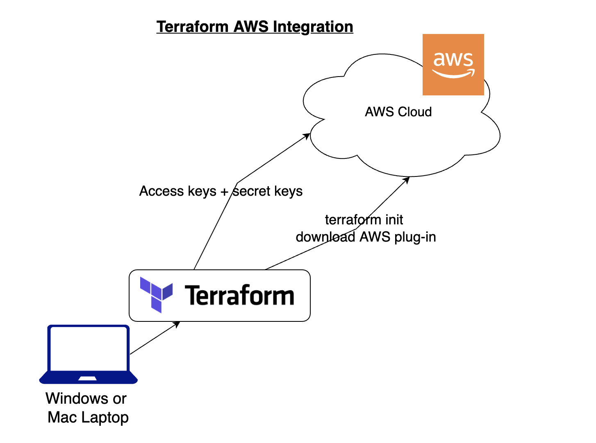

# AWS EC2 Instance Creation
This project uses Terraform to provision an AWS EC2 instance in the `ap-south-1` region using my `anil-devops` AWS profile.


## Prerequisites

Before you can deploy this Terraform configuration, make sure you have the following:

- **AWS CLI** installed and configured with your correct profile (`eg. anil-devops`).
- **Terraform** installed.
- AWS credentials with appropriate permissions to create EC2 instances.

## Terraform Configuration

### Provider Configuration

This project uses the AWS provider to interact with AWS services.

```hcl
provider "aws" {
  profile = "anil-devops"
  region  = "ap-south-1"
}
```

### Resource: EC2 Instance

The EC2 instance is configured using the following resource block:
```hcl
resource "aws_instance" "anil_tf_example" {
  ami           = "ami-0dee22c13ea7a9a67"
  instance_type = "t2.micro"
}
```
- **AMI ID** : The Amazon Machine Image (AMI) used for the instance. This is for ubuntu
- **Instance Type** : The instance type is set to t2.micro, which is part of the free tier.

## Usage
### Initialize Terraform:
Run this command to initialize the working directory with the necessary Terraform configuration:

```bash
terraform init
```

### Plan the Deployment:
Review the actions Terraform will perform without actually applying them:

```bash
terraform plan
```

### Apply the Configuration:
Create the EC2 instance by applying the Terraform plan:

```bash
terraform apply
```

### Destroy Resources:
To delete the EC2 instance and any other resources created by Terraform:

```bash
terraform destroy
```
**Make sure you destroy your creation, I am not responsible for your unnecessary bills** :laughing:


## Notes
- Make sure your AWS credentials have sufficient permissions to create and destroy EC2 instances.

- The profile name used here is `anil-devops`, so ensure this profile is correctly set up in your AWS CLI configuration. If you didn't choosed one, automatically the `default` will be choosed.